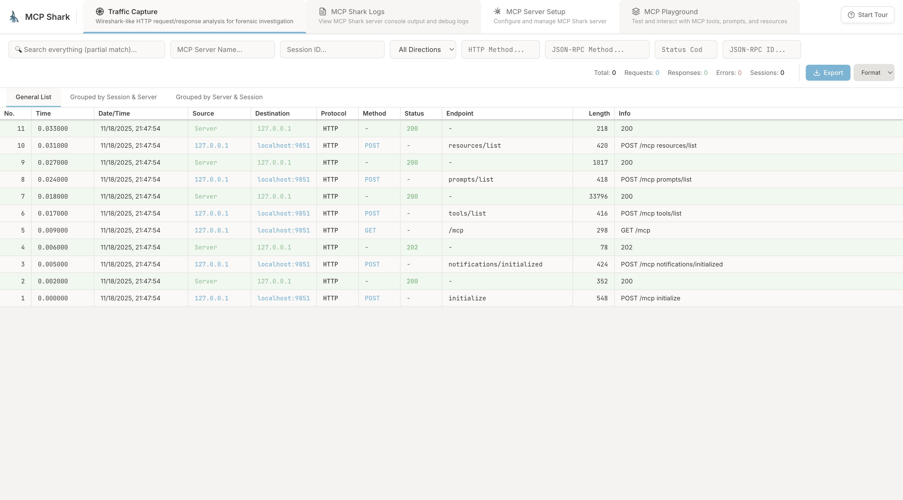
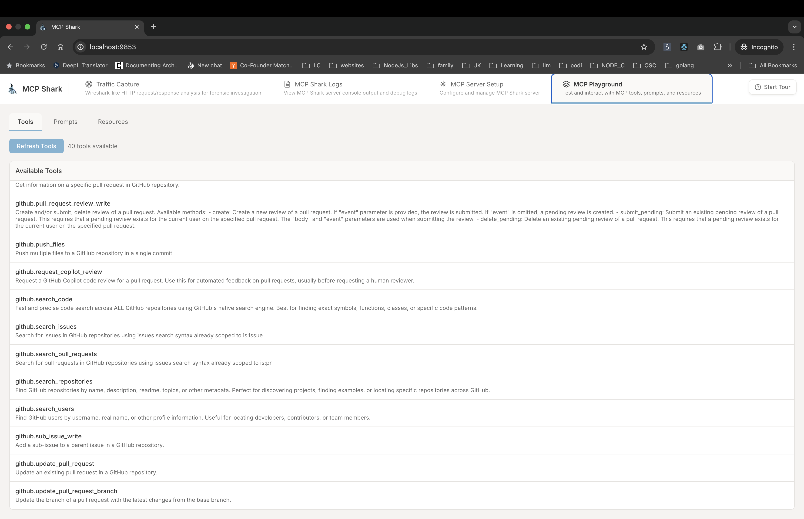
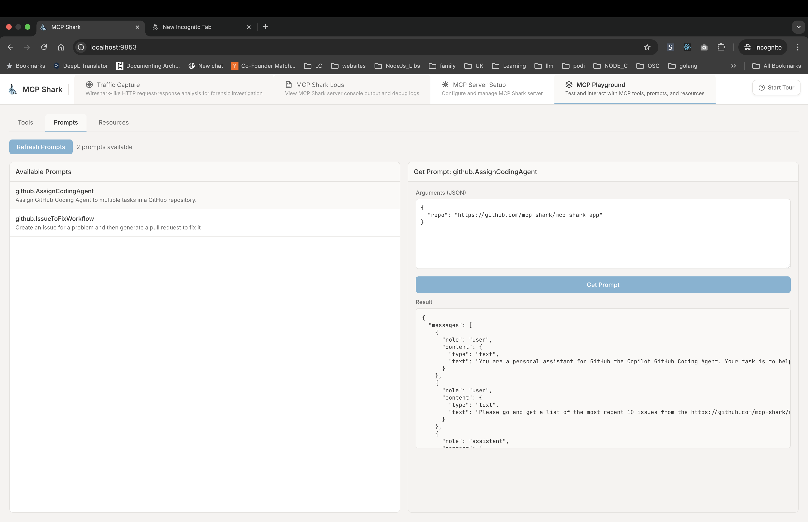
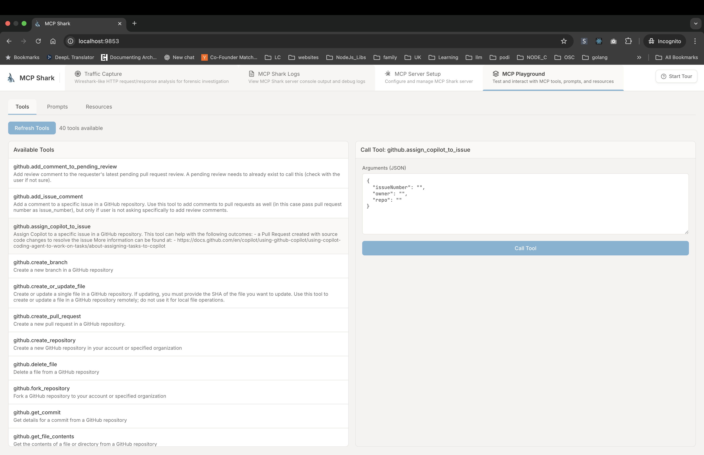
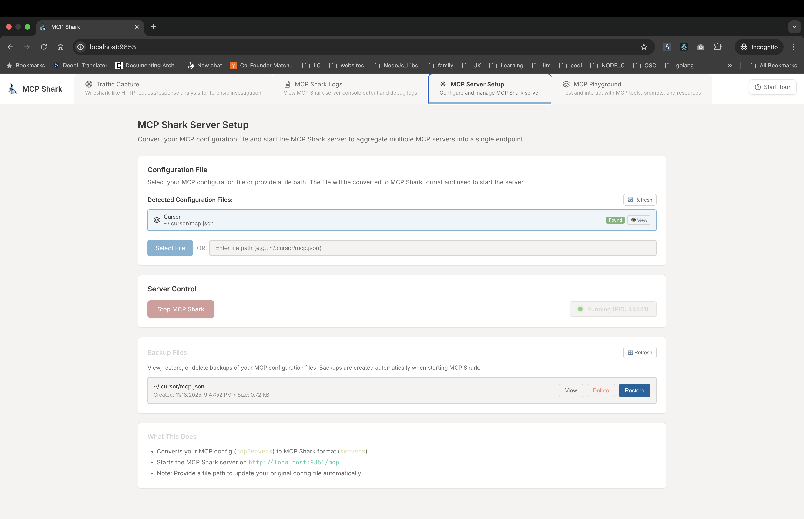
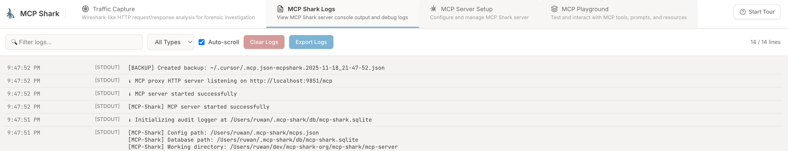

# MCP Shark

## Download Desktop App

| Platform    | Download                                                                                                                  |
| ----------- | ------------------------------------------------------------------------------------------------------------------------- |
| **macOS**   | [Download (ARM64)](https://github.com/mcp-shark/mcp-shark-app/releases/download/v1.2.0/MCP.Shark-1.2.0-arm64-mac.zip)     |
| **Windows** | [Download (Installer)](https://github.com/mcp-shark/mcp-shark-app/releases/download/v1.2.0/MCP.Shark.Setup.1.2.0.exe)     |
| **Linux**   | [Download (ARM64 DEB)](https://github.com/mcp-shark/mcp-shark-app/releases/download/v1.2.0/mcp-shark-app_1.2.0_arm64.deb) |

> **⚠️ ALPHA VERSION - STILL TESTING**  
> This is an alpha version of MCP Shark. The software is still under active development and testing. Features may change, and there may be bugs or incomplete functionality. Use at your own risk.

> **Aggregate multiple Model Context Protocol (MCP) servers into a single unified interface with a powerful monitoring UI**

MCP Shark is a complete solution for aggregating multiple MCP servers (both HTTP and stdio-based) into one cohesive endpoint, with a real-time web interface for monitoring and inspecting all communications. Think of it as **Wireshark for MCP** - providing deep visibility into every request and response.



## Table of Contents

- [IDE Support](#ide-support)
  - [Supported IDEs](#supported-ides)
  - [Automatic Configuration](#automatic-configuration)
  - [Zero-Configuration Setup](#zero-configuration-setup)
- [MCP Playground](#mcp-playground)
  - [Interactive Tool Testing](#interactive-tool-testing)
  - [Prompt Exploration](#prompt-exploration)
  - [Resource Browsing](#resource-browsing)
  - [Session Management](#session-management)
  - [Use Cases](#use-cases)
- [Key Features](#key-features)
  - [Multi-Server Aggregation](#multi-server-aggregation)
  - [Real-Time Monitoring & Analysis](#real-time-monitoring--analysis)
  - [Analytics & Statistics](#analytics--statistics)
  - [Data Management](#data-management)
  - [Modern UI/UX](#modern-uiux)
  - [Configuration Management](#configuration-management)
- [Quick Start](#quick-start)
  - [Installation](#installation)
  - [Available Commands](#available-commands)
- [User Guide](#user-guide)
  - [Getting Started](#getting-started)
  - [UI Tabs Overview](#ui-tabs-overview)
    - [Traffic Capture](#traffic-capture)
    - [MCP Playground](#mcp-playground-1)
    - [MCP Shark Logs](#mcp-shark-logs)
    - [MCP Server Setup](#mcp-server-setup)
  - [Advanced Features](#advanced-features)
    - [Exporting Data](#exporting-data)
    - [Backup Management](#backup-management)
    - [Session Management](#session-management-1)
    - [Performance Analysis](#performance-analysis)
- [Architecture](#architecture)
- [Project Structure](#project-structure)
- [Supported MCP Methods](#supported-mcp-methods)
  - [Tool Naming Convention](#tool-naming-convention)
- [Audit Logging](#audit-logging)
  - [Database Schema](#database-schema)
- [Electron App](#electron-app)
- [Requirements](#requirements)
- [Configuration](#configuration)
  - [Automatic Configuration](#automatic-configuration-1)
  - [Manual Configuration](#manual-configuration)
- [Use Cases](#use-cases-1)
  - [Development & Debugging](#development--debugging)
  - [Testing & QA](#testing--qa)
  - [Monitoring & Analytics](#monitoring--analytics)
  - [Learning & Exploration](#learning--exploration)
- [Contributing](#contributing)
- [Additional Resources](#additional-resources)
- [Related Projects](#related-projects)
- [Troubleshooting](#troubleshooting)
  - [Server Won't Start](#server-wont-start)
  - [No Traffic Appearing](#no-traffic-appearing)
  - [Configuration Issues](#configuration-issues)
- [License](#license)

## IDE Support

MCP Shark provides seamless integration with popular IDEs and editors:

### Supported IDEs

- **Cursor** — Automatically detects and uses `~/.cursor/mcp.json`
- **Windsurf** — Automatically detects and uses `~/.codeium/windsurf/mcp_config.json`
- **Custom Configurations** — Upload and use any MCP configuration file

### Automatic Configuration

MCP Shark automatically:

- Detects your IDE's MCP configuration files
- Converts IDE-specific config formats to MCP Shark format
- Creates backups before making any changes
- Updates your IDE config to point to MCP Shark server
- Restores original configuration when you stop the server

### Zero-Configuration Setup

1. Start MCP Shark UI
2. Select your IDE from the detected list (or upload your config)
3. Choose which servers to enable (optional)
4. Click "Start MCP Shark"
5. Your IDE is now using MCP Shark automatically

No manual configuration editing required - MCP Shark handles everything for you.

## MCP Playground

**The MCP Playground is one of MCP Shark's most powerful features** — an interactive testing environment that lets you explore, test, and experiment with all your MCP servers directly from the web UI.



### Interactive Tool Testing

Test any tool from any connected server with custom arguments:

- Browse all available tools from all servers in one place
- See tool descriptions, parameters, and schemas
- Call tools with custom JSON arguments
- View results in real-time with formatted output
- Test edge cases and different parameter combinations

### Prompt Exploration

Explore and test prompts interactively:



- List all prompts from all connected servers
- View prompt descriptions and argument schemas
- Test prompts with different arguments
- See formatted prompt results
- Understand how prompts work across different servers

### Resource Browsing

Browse and read resources from all servers:

- Discover all available resources across all servers
- Read resource contents directly in the UI
- Explore resource URIs and metadata
- Understand resource structure and format

### Session Management

The Playground maintains session state for stateful interactions:



- Automatic session tracking
- Maintains context across multiple tool calls
- Test stateful workflows and conversations
- Debug session-related issues

### Use Cases

- **Development**: Test tools before integrating them into your code
- **Debugging**: Verify tool behavior and troubleshoot issues
- **Exploration**: Discover what tools and resources are available
- **Learning**: Understand how different MCP servers work
- **Documentation**: Generate examples and test cases

Access the Playground from the "MCP Playground" tab in the UI after starting your MCP Shark server.

## Key Features

### Multi-Server Aggregation

- Connect to multiple MCP servers simultaneously (HTTP and stdio)
- Unified API for tools, prompts, and resources from all servers
- Service selection — choose which servers to activate
- Automatic load balancing and failover

### Real-Time Monitoring & Analysis

- **Live Traffic Capture** — WebSocket-powered real-time updates
- **Wireshark-like Interface** — Detailed packet inspection with frame numbers, timestamps, and protocol information
- **Multiple View Modes**:
  - General list view
  - Grouped by session & server
  - Grouped by server & session
- **Advanced Filtering** — Filter by method, status, protocol, session, server, direction, and more
- **Full-Text Search** — Search across all fields including URLs, endpoints, and JSON-RPC methods


### Analytics & Statistics

- **Traffic Statistics** — View request counts, unique sessions, and server activity
- **Performance Metrics** — Duration, latency, and timing information for each request
- **Error Tracking** — Comprehensive error logging with stack traces
- **Session Analytics** — Track conversations and stateful interactions

### Data Management

- **Export Capabilities** — Export captured traffic in JSON, CSV, or TXT formats
- **Backup Management** — Automatic backups of configuration files with restore functionality
- **Log Export** — Export server logs as text files
- **SQLite Database** — Efficient storage with direct database access for advanced analysis

### Modern UI/UX

- **Dark Theme** — Developer-friendly dark interface
- **Interactive Tour** — Built-in onboarding guide for first-time users
- **Responsive Design** — Works seamlessly across different screen sizes
- **Animated Transitions** — Smooth animations for better user experience
- **Hex View** — Binary data inspection with hex viewer
- **Raw/JSON View** — Multiple payload viewing modes (Raw, JSON, Hex)

### Configuration Management

- **Auto-Detection** — Automatically detects IDE configuration files
- **Config Conversion** — Converts IDE config format to MCP Shark format
- **Backup & Restore** — Automatic backups before making changes
- **Config Viewer** — View and inspect configuration files and backups
- **Service Filtering** — Selectively enable/disable specific servers

## Quick Start



### Installation

1. **Install dependencies:**

```bash
npm run install:all
```

Or using Make:

```bash
make install-all
```

2. **Start the UI:**

```bash
make start
```

Or using npm:

```bash
npm start
```

3. **Open your browser:**

Navigate to `http://localhost:9853`

That's it! The interactive tour will guide you through the setup process on first launch.

### Available Commands

**Using Make (Recommended):**

```bash
make start          # Start the UI server (default)
make stop           # Stop the UI server
make dev-ui         # Start UI in development mode with hot reload
make build-ui       # Build UI for production
make install-all    # Install all dependencies
make help           # Show all available commands
```

**Using npm:**

```bash
npm start           # Start the UI server
npm run dev:ui      # Start UI in development mode
npm run build:ui    # Build UI for production
npm run install:all # Install all dependencies
```

## User Guide

### Getting Started

1. **Start the UI**: Run `make start` or `npm start`
2. **Interactive Tour**: On first launch, you'll see an interactive tour - follow it to get started
3. **Configure Servers**: Go to the "MCP Server Setup" tab
4. **Select Configuration**: Choose from detected editors or upload your own config file
5. **Start Monitoring**: Click "Start MCP Shark" to begin capturing traffic

### UI Tabs Overview

#### Traffic Capture

The main monitoring interface with Wireshark-like capabilities:


- **Real-time Updates**: See requests and responses as they happen
- **Multiple Views**:
  - **General List**: Flat chronological view of all traffic
  - **Grouped by Session & Server**: Organize by conversation sessions
  - **Grouped by Server & Session**: Organize by server activity
- **Advanced Filters**:
  - Search across all fields
  - Filter by HTTP method (GET, POST, etc.)
  - Filter by status code
  - Filter by protocol
  - Filter by direction (Request/Response)
  - Filter by session ID
  - Filter by server name
- **Packet Details**: Click any packet to see:
  - Full headers
  - Request/response body
  - Timing information
  - JSON-RPC details
  - Raw, JSON, and Hex views
- **Export**: Export filtered results in JSON, CSV, or TXT formats
- **Statistics**: View traffic statistics including request counts and unique sessions

#### MCP Playground

Interactive testing environment for MCP servers — **one of MCP Shark's standout features**:

- **Tools Section**:
  - Browse all available tools from all servers
  - Call tools with custom arguments
  - View results in real-time
  - See tool descriptions and parameters
- **Prompts Section**:
  - List all prompts from all servers
  - Test prompts with different arguments
  - View prompt results
- **Resources Section**:
  - Browse available resources
  - Read resource contents
  - Explore resource URIs
- **Session Management**: Maintains session state for stateful interactions

This is the perfect place to explore your MCP servers, test tools, and understand what capabilities are available.

#### MCP Shark Logs

Server console output and debugging:



- **Real-time Logs**: See server output as it happens
- **Log Filtering**: Filter by log type (stdout, stderr, error)
- **Export Logs**: Export logs as text files
- **Auto-scroll**: Automatically scrolls to latest logs
- **Color-coded**: Different colors for different log types

#### MCP Server Setup

Configuration and server management:


- **Config Detection** — Automatically detects config files from:
  - Cursor: `~/.cursor/mcp.json`
  - Windsurf: `~/.codeium/windsurf/mcp_config.json`
- **File Upload** — Upload your own MCP configuration file
- **Service Selection** — Choose which servers to enable
- **Config Viewer** — View and inspect configuration files
- **Start/Stop Server** — Control the MCP Shark server
- **Backup Management**:
  - View all backups with timestamps
  - Restore any backup
  - Delete backups
  - View backup contents

### Advanced Features

#### Exporting Data

**Traffic Export:**

1. Go to **Traffic Capture** tab
2. Apply any filters (optional)
3. Click **Export** button
4. Choose format:
   - **JSON**: Full structured data with all metadata
   - **CSV**: Spreadsheet-friendly format
   - **TXT**: Human-readable text format

**Log Export:**

1. Go to **MCP Shark Logs** tab
2. Click **Export Logs** button
3. Logs are exported as a text file

#### Backup Management

MCP Shark automatically creates backups before modifying your configuration:

1. Go to **MCP Server Setup** tab
2. Scroll to **"Backed Up Configuration Files"** section
3. View all backups with:
   - Original file path
   - Backup location
   - Creation timestamp
   - File size
4. Actions available:
   - **View**: Inspect backup contents
   - **Restore**: Restore backup to original location
   - **Delete**: Remove backup file

#### Session Management

- **Automatic Session Tracking** — Sessions are automatically tracked and displayed
- **Session Filtering** — Filter traffic by specific session IDs
- **Session Grouping** — View traffic grouped by session for conversation analysis
- **Session Persistence** — Sessions are maintained across requests

#### Performance Analysis

Each request/response includes:

- **Duration** — Total request/response time
- **Latency** — Network latency measurements
- **Payload Size** — Request and response sizes
- **Status Codes** — HTTP status codes
- **Timing Breakdown** — Detailed timing information

## Architecture

```
┌─────────────────┐
│   MCP Client    │
│   (Your IDE)    │
└────────┬────────┘
         │ HTTP
         ▼
┌─────────────────────────────────┐
│   MCP Shark UI (Port 9853)       │
│   - Real-time monitoring         │
│   - Server management            │
│   - Log inspection               │
│   - Configuration management     │
│   - MCP Playground               │
│   - WebSocket updates            │
│   └──► Manages & starts          │
└──────────┬───────────────────────┘
           │ spawns
           ▼
┌─────────────────────────────────┐
│   MCP Shark Server (Port 9851)  │
│   - Aggregates MCP servers      │
│   - HTTP & stdio transport      │
│   - Audit logging (SQLite)      │
│   - Session management           │
│   - Request correlation          │
└──────────┬───────────────────────┘
           │
           ├──► HTTP MCP Servers
           └──► stdio MCP Servers
```

## Project Structure

```
mcp-shark/
├── mcp-server/           # MCP aggregation server
│   ├── mcp-shark.js      # Main entry point
│   ├── lib/              # Server implementation
│   │   ├── server/       # Server logic
│   │   │   ├── internal/ # Internal MCP server (aggregator)
│   │   │   └── external/ # External MCP server clients
│   │   ├── auditor/     # Audit logging
│   │   └── common/      # Common utilities
│   └── temp/            # Config and database
├── ui/                   # Web UI
│   ├── src/              # React components
│   │   ├── components/  # UI components
│   │   │   ├── McpPlayground/ # Playground components
│   │   │   └── PacketFilters/ # Filter components
│   │   ├── hooks/        # React hooks
│   │   ├── utils/       # Utility functions
│   │   └── config/     # Configuration
│   ├── server/           # Express server
│   │   ├── routes/      # API routes
│   │   └── utils/       # Server utilities
│   ├── server.js        # Express server entry
│   └── dist/            # Built frontend
├── package.json          # Root package.json
└── README.md             # This file
```

## Supported MCP Methods

MCP Shark supports all standard MCP methods:

- **`tools/list`** - List all tools from all servers
- **`tools/call`** - Call a tool from any server (with server prefix: `server:tool_name`)
- **`prompts/list`** - List all prompts from all servers
- **`prompts/get`** - Get a specific prompt
- **`resources/list`** - List all resources from all servers
- **`resources/read`** - Read a specific resource

### Tool Naming Convention

When calling tools, prefix with the server name:

- `github:search_repositories` - Calls `search_repositories` from the `github` server
- `@21st-dev/magic:create_component` - Calls `create_component` from the `@21st-dev/magic` server

## Audit Logging

All MCP communications are logged to SQLite (default location: `~/.mcp-shark/db/mcp-shark.sqlite`) with:

- **Request/Response Tracking**: Full payload logging with correlation IDs
- **Performance Metrics**: Duration, latency, and timing information
- **Error Tracking**: Comprehensive error logging with stack traces
- **Session Management**: Session ID tracking for stateful interactions
- **Server Identification**: Track which external server handled each request
- **Request Correlation**: Match requests with their responses

### Database Schema

The database includes:

- **`mcp_communications`**: All request/response communications
- **`mcp_request_response_pairs`**: Correlated request/response pairs
- **Sessions**: Automatic session tracking

The database can be accessed directly for advanced analysis or exported through the UI in JSON, CSV, or TXT formats.

## Electron App

MCP Shark is also available as a desktop application! The [mcp-shark-app](https://github.com/mcp-shark/mcp-shark-app) repository provides an Electron wrapper that packages MCP Shark into a native desktop application for Windows, macOS, and Linux.

**Desktop App Features:**

- Integrated browser window
- Automatic process management
- Native OS integration
- No need to manage ports or processes manually

## Requirements

- **Node.js** 18+ and npm
- **Git** (for installing dependencies from GitHub)

## Configuration

### Automatic Configuration

MCP Shark automatically detects and converts configuration files from:

- **Cursor** — `~/.cursor/mcp.json`
- **Windsurf** — `~/.codeium/windsurf/mcp_config.json`

### Manual Configuration

If you need to configure manually, create a file at `~/.mcp-shark/mcps.json`:

**HTTP Server:**

```json
{
  "servers": {
    "github": {
      "type": "http",
      "url": "https://api.githubcopilot.com/mcp/",
      "headers": {
        "Authorization": "Bearer YOUR_TOKEN"
      }
    }
  }
}
```

**stdio Server:**

```json
{
  "servers": {
    "@21st-dev/magic": {
      "type": "stdio",
      "command": "npx",
      "args": ["-y", "@21st-dev/magic@latest", "API_KEY=\"your-api-key\""]
    }
  }
}
```

## Use Cases

### Development & Debugging

- Debug MCP server interactions
- Inspect request/response payloads
- Analyze performance bottlenecks
- Track down errors and issues

### Testing & QA

- Test MCP tools, prompts, and resources using the Playground
- Verify server responses
- Validate configuration changes
- Test with different arguments

### Monitoring & Analytics

- Monitor MCP server usage
- Track API call patterns
- Analyze traffic statistics
- Export data for reporting

### Learning & Exploration

- Understand MCP protocol
- Explore available tools and resources using the Playground
- Learn how different servers work
- Experiment with MCP capabilities

## Contributing

We welcome contributions! Please see:

- **[CONTRIBUTING.md](./CONTRIBUTING.md)**: Guidelines for contributing
- **[DEVELOPERS.md](./DEVELOPERS.md)**: Developer guide and setup
- **[SETUP.md](./SETUP.md)**: Initial setup instructions

## Additional Resources

- **[DEVELOPERS.md](./DEVELOPERS.md)**: Developer guide and setup instructions
- **[CONTRIBUTING.md](./CONTRIBUTING.md)**: Guidelines for contributing to the project
- **[SETUP.md](./SETUP.md)**: Initial setup and git hooks configuration
- **[LICENSE](./LICENSE)**: License information

## Related Projects

- **[mcp-shark-app](https://github.com/mcp-shark/mcp-shark-app)**: Electron desktop application wrapper
- **[mcp-shark-site](https://github.com/mcp-shark/mcp-shark-site)**: Official website and documentation
- **[mcp-shark-common](https://github.com/mcp-shark/mcp-shark-common)**: Shared utilities and common code

## Troubleshooting

### Server Won't Start

- Check if port 9851 is already in use
- Verify configuration file is valid JSON
- Check logs in the "MCP Shark Logs" tab
- Ensure all required dependencies are installed

### No Traffic Appearing

- Verify MCP Shark server is running (check status in Setup tab)
- Ensure your IDE is configured to use `http://localhost:9851/mcp`
- Check that your original config file was updated correctly
- Restart the MCP Shark server

### Configuration Issues

- Verify your config file is valid JSON
- Check that server URLs are accessible
- Ensure stdio commands are available in PATH
- Review backup files if original config was modified

## License

ISC

---

**Built with the Model Context Protocol SDK**
