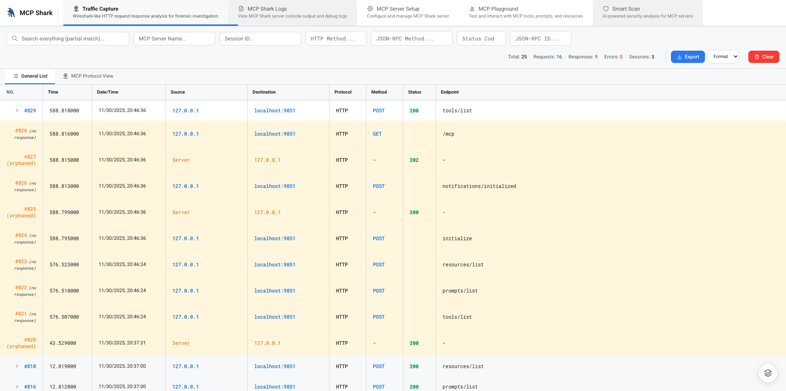
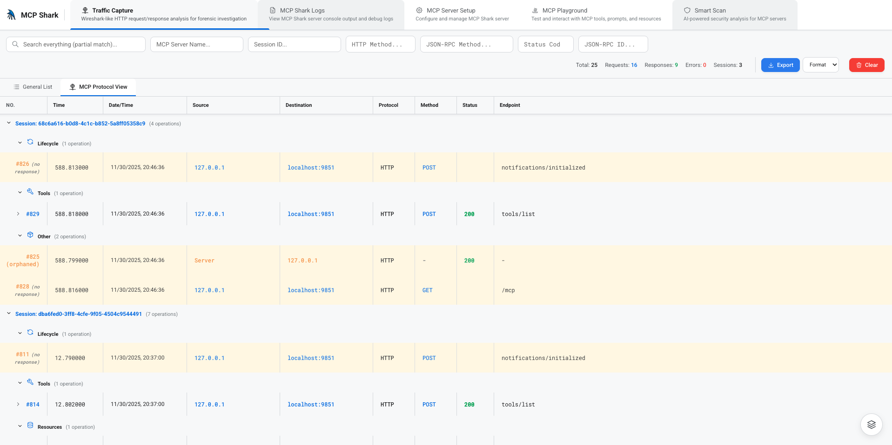
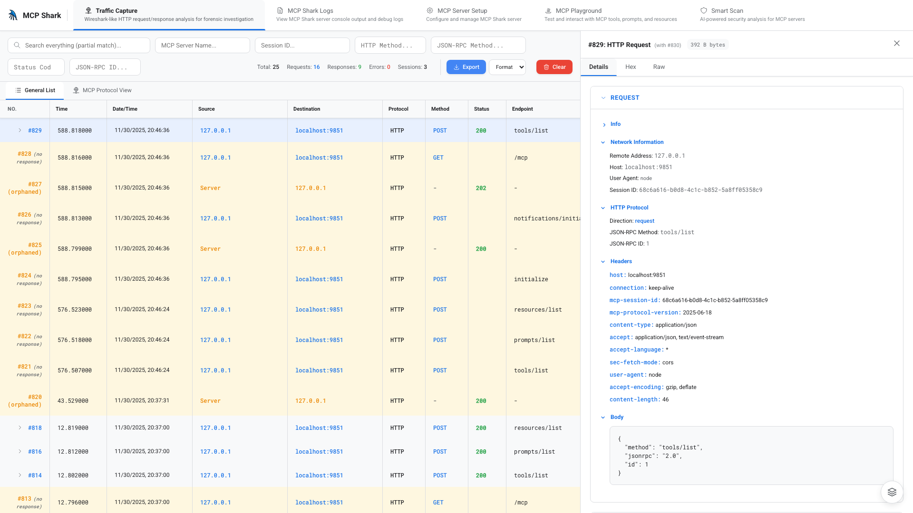
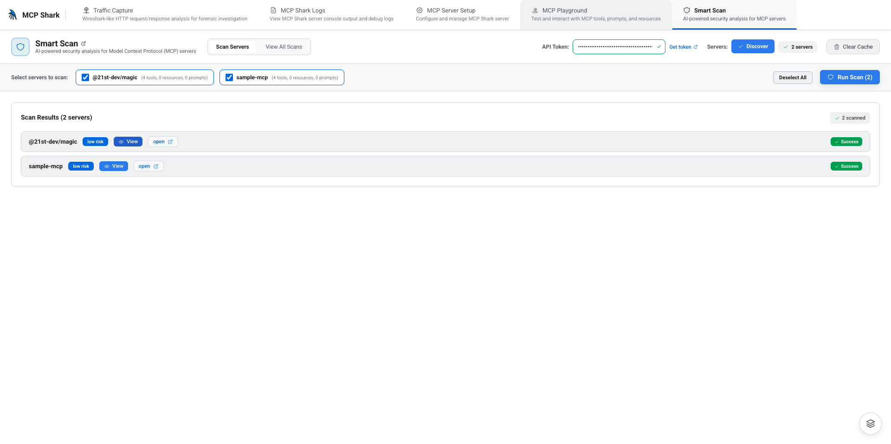
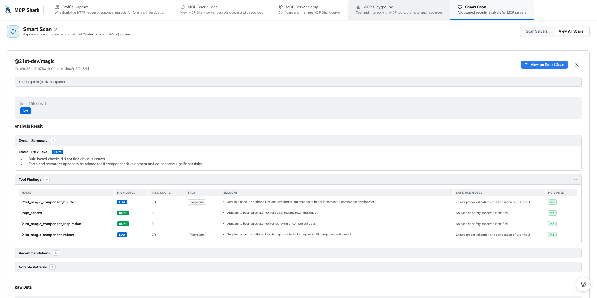

<div align="center">

  

  <h1>@mcp-shark/mcp-shark</h1>

  <p>Aggregate multiple Model Context Protocol (MCP) servers into a single unified interface with a powerful monitoring UI</p>

</div>

[](https://www.npmjs.com/package/@mcp-shark/mcp-shark)
[](LICENSE)

## 📦 Download Desktop App

Prefer a desktop application? Download the native desktop app:

| Platform    | Download                                                                                                                  |
| ----------- | ------------------------------------------------------------------------------------------------------------------------- |
| **macOS**   | [Download (ARM64)](https://github.com/mcp-shark/mcp-shark-app/releases/download/v1.3.0/MCP.Shark-1.3.0-arm64-mac.zip)     |
| **Windows** | [Download (Installer)](https://github.com/mcp-shark/mcp-shark-app/releases/download/v1.3.0/MCP.Shark.Setup.1.3.0.exe)     |
| **Linux**   | [Download (ARM64 DEB)](https://github.com/mcp-shark/mcp-shark-app/releases/download/v1.3.0/mcp-shark-app_1.3.0_arm64.deb) |

> **⚠️ ALPHA VERSION - STILL TESTING**  
> This is an alpha version of MCP Shark. The software is still under active development and testing. Features may change, and there may be bugs or incomplete functionality. Use at your own risk.

## 📦 npm Package

### Installation

**Install globally (recommended):**

```bash
npm install -g @mcp-shark/mcp-shark
```

**Install locally in your project:**

```bash
npm install @mcp-shark/mcp-shark
```

**Use npx (no installation required):**

```bash
npx @mcp-shark/mcp-shark
```

### Usage

After global installation, simply run:

```bash
mcp-shark
```

Or with npx:

```bash
npx @mcp-shark/mcp-shark
```

Or if installed locally:

```bash
npx @mcp-shark/mcp-shark
```

The UI will automatically:

- Install dependencies if needed
- Build the frontend if needed
- Start the server on `http://localhost:9853`

Open your browser to `http://localhost:9853` to access the MCP Shark interface.

### Package Information

- **Package Name**: `@mcp-shark/mcp-shark`
- **npm Registry**: [https://www.npmjs.com/package/@mcp-shark/mcp-shark](https://www.npmjs.com/package/@mcp-shark/mcp-shark)
- **Version**: Check latest version on npm
- **License**: Source-Available Non-Commercial (see [LICENSE](LICENSE) for details)
- **Node.js**: Requires Node.js 18+

## 📖 Table of Contents

- [npm Package](#-npm-package)
  - [Installation](#installation)
  - [Usage](#usage)
  - [Package Information](#package-information)
- [About](#about)
- [Key Features](#-key-features)
  - [Multi-Server Aggregation](#-multi-server-aggregation)
  - [Real-Time Monitoring & Analysis](#-real-time-monitoring--analysis)
  - [MCP Playground](#-mcp-playground)
  - [Smart Scan](#-smart-scan)
  - [IDE Integration](#-ide-integration)
  - [Analytics & Statistics](#-analytics--statistics)
  - [Data Management](#-data-management)
  - [Modern UI/UX](#-modern-uiux)
  - [Configuration Management](#-configuration-management)
- [User Guide](#-user-guide)
  - [Getting Started](#getting-started)
  - [UI Tabs Overview](#ui-tabs-overview)
    - [Traffic Capture](#traffic-capture)
    - [MCP Playground](#mcp-playground-1)
    - [Smart Scan](#smart-scan-1)
    - [MCP Shark Logs](#mcp-shark-logs)
    - [MCP Server Setup](#mcp-server-setup)
  - [Advanced Features](#advanced-features)
    - [Exporting Data](#exporting-data)
    - [Backup Management](#backup-management)
    - [Session Management](#session-management-1)
    - [Performance Analysis](#performance-analysis)
- [Architecture](#-architecture)
- [Supported MCP Methods](#-supported-mcp-methods)
- [Audit Logging](#-audit-logging)
- [Configuration](#-configuration)
- [Use Cases](#-use-cases)
- [Requirements](#-requirements)
- [Troubleshooting](#-troubleshooting)
- [Contributing](#-contributing)
- [Related Projects](#-related-projects)
- [License](#-license)

## About

MCP Shark is a complete solution for aggregating multiple MCP servers (both HTTP and stdio-based) into one cohesive endpoint, with a real-time web interface for monitoring and inspecting all communications. Think of it as **Wireshark for MCP** - providing deep visibility into every request and response.


## 📦 Desktop App

Prefer a desktop application? Download the native desktop app:

| Platform    | Download                                                                                                                  |
| ----------- | ------------------------------------------------------------------------------------------------------------------------- |
| **macOS**   | [Download (ARM64)](https://github.com/mcp-shark/mcp-shark-app/releases/download/v1.3.0/MCP.Shark-1.3.0-arm64-mac.zip)     |
| **Windows** | [Download (Installer)](https://github.com/mcp-shark/mcp-shark-app/releases/download/v1.3.0/MCP.Shark.Setup.1.3.0.exe)     |
| **Linux**   | [Download (ARM64 DEB)](https://github.com/mcp-shark/mcp-shark-app/releases/download/v1.3.0/mcp-shark-app_1.3.0_arm64.deb) |

## ✨ Key Features

### 🔗 Multi-Server Aggregation

- Connect to multiple MCP servers simultaneously (HTTP and stdio)
- Unified API for tools, prompts, and resources from all servers
- Service selection — choose which servers to activate
- Automatic load balancing and failover
- Support for both HTTP and stdio-based MCP servers

### 📊 Real-Time Monitoring & Analysis

**Wireshark-like Interface** — Detailed packet inspection with frame numbers, timestamps, and protocol information



**Multiple View Modes:**

- **General List View** — Flat chronological view of all traffic
- **Grouped by Session & Server** — Organize by conversation sessions
- **Grouped by Server & Session** — Organize by server activity
- **Protocol View** — View traffic by protocol type



**Advanced Features:**

- **Live Traffic Capture** — WebSocket-powered real-time updates
- **Advanced Filtering** — Filter by method, status, protocol, session, server, direction, and more
- **Full-Text Search** — Search across all fields including URLs, endpoints, and JSON-RPC methods
- **Detailed Packet Inspection** — Click any packet to see full headers, request/response body, timing information, and JSON-RPC details



### 🎮 MCP Playground

**Interactive testing environment for exploring and testing MCP servers** — one of MCP Shark's standout features.


**Interactive Tool Testing:**

- Browse all available tools from all servers in one place
- See tool descriptions, parameters, and schemas
- Call tools with custom JSON arguments
- View results in real-time with formatted output
- Test edge cases and different parameter combinations

**Prompt Exploration:**

- List all prompts from all connected servers
- View prompt descriptions and argument schemas
- Test prompts with different arguments
- See formatted prompt results
- Understand how prompts work across different servers

**Resource Browsing:**

- Discover all available resources across all servers
- Read resource contents directly in the UI
- Explore resource URIs and metadata
- Understand resource structure and format

**Session Management:**

- Automatic session tracking
- Maintains context across multiple tool calls
- Test stateful workflows and conversations
- Debug session-related issues

**Use Cases:**

- **Development**: Test tools before integrating them into your code
- **Debugging**: Verify tool behavior and troubleshoot issues
- **Exploration**: Discover what tools and resources are available
- **Learning**: Understand how different MCP servers work
- **Documentation**: Generate examples and test cases

### 🔍 Smart Scan

**AI-powered security analysis for MCP servers** — automatically scan and analyze your MCP servers for potential security risks and vulnerabilities.



**AI-Powered Security Analysis:**

- **Automated Scanning** — Discover and scan multiple MCP servers automatically
- **Security Risk Assessment** — Get overall risk levels (LOW, MEDIUM, HIGH) for each server
- **Detailed Findings** — View comprehensive security analysis including:
  - Tool security analysis
  - Prompt injection risks
  - Resource access patterns
  - Overall security recommendations
- **Cached Results** — Results are cached for quick access without re-scanning

**Batch Scanning:**

- **Server Discovery** — Automatically discover MCP servers from your configuration
- **Selective Scanning** — Choose which servers to scan
- **Batch Processing** — Scan multiple servers in parallel
- **Progress Tracking** — Monitor scan progress in real-time

**Risk Assessment:**

- **Overall Risk Level** — Quick visual indicator of security posture
- **Detailed Findings** — Comprehensive list of security concerns
- **Recommendations** — Actionable security recommendations
- **Full Report Access** — View complete analysis reports with detailed findings
  - Click "view results" button in the scan results to open full reports
  - Reports are available at [https://smart.mcpshark.sh](https://smart.mcpshark.sh)
  - Each scan result includes a direct link to its detailed analysis page



### 🔌 IDE Integration

**Seamless integration with popular IDEs and editors:**

- **Cursor** — Automatically detects and uses `~/.cursor/mcp.json`
- **Windsurf** — Automatically detects and uses `~/.codeium/windsurf/mcp_config.json`
- **Custom Configurations** — Upload and use any MCP configuration file

**Automatic Configuration:**

- Detects your IDE's MCP configuration files
- Converts IDE-specific config formats to MCP Shark format
- Creates backups before making any changes
- Updates your IDE config to point to MCP Shark server
- Restores original configuration when you stop the server

**Zero-Configuration Setup:**

1. Start MCP Shark UI
2. Select your IDE from the detected list (or upload your config)
3. Choose which servers to enable (optional)
4. Click "Start MCP Shark"
5. Your IDE is now using MCP Shark automatically

No manual configuration editing required - MCP Shark handles everything for you.


### 📈 Analytics & Statistics

- **Traffic Statistics** — View request counts, unique sessions, and server activity
- **Performance Metrics** — Duration, latency, and timing information for each request
- **Error Tracking** — Comprehensive error logging with stack traces
- **Session Analytics** — Track conversations and stateful interactions

### 💾 Data Management

- **Export Capabilities** — Export captured traffic in JSON, CSV, or TXT formats
- **Backup Management** — Automatic backups of configuration files with restore functionality
- **Log Export** — Export server logs as text files
- **SQLite Database** — Efficient storage with direct database access for advanced analysis

### 🎨 Modern UI/UX

- **Dark Theme** — Developer-friendly dark interface
- **Interactive Tour** — Built-in onboarding guide for first-time users
- **Responsive Design** — Works seamlessly across different screen sizes
  - **Adaptive Navigation** — Dropdown menu for smaller windows (< 1200px)
  - **Compact Views** — Optimized layouts for mobile and tablet devices
- **Animated Transitions** — Smooth animations for better user experience
- **Hex View** — Binary data inspection with hex viewer
- **Raw/JSON View** — Multiple payload viewing modes (Raw, JSON, Hex)
- **Compact Scan Results** — Single-row display for scan results with quick access to full reports

### ⚙️ Configuration Management

- **Auto-Detection** — Automatically detects IDE configuration files
- **Config Conversion** — Converts IDE config format to MCP Shark format
- **Backup & Restore** — Automatic backups before making changes
- **Config Viewer** — View and inspect configuration files and backups
- **Service Filtering** — Selectively enable/disable specific servers

## 📚 User Guide

### Getting Started

1. **Install MCP Shark:**

```bash
   npm install -g @mcp-shark/mcp-shark
```

2. **Start MCP Shark:**

```bash
   mcp-shark
```

3. **Open your browser:**
   Navigate to `http://localhost:9853`

4. **Interactive Tour**: On first launch, you'll see an interactive tour - follow it to get started

5. **Configure Servers**: Go to the "MCP Server Setup" tab

6. **Select Configuration**: Choose from detected editors or upload your own config file

7. **Start Monitoring**: Click "Start MCP Shark" to begin capturing traffic

### UI Tabs Overview

#### Traffic Capture

The main monitoring interface with Wireshark-like capabilities:

- **Real-time Updates**: See requests and responses as they happen
- **Multiple Views**:
  - **General List**: Flat chronological view of all traffic
  - **Grouped by Session & Server**: Organize by conversation sessions
  - **Grouped by Server & Session**: Organize by server activity
  - **Protocol View**: View traffic by protocol type
- **Advanced Filters**:
  - Search across all fields
  - Filter by HTTP method (GET, POST, etc.)
  - Filter by status code
  - Filter by protocol
  - Filter by direction (Request/Response)
  - Filter by session ID
  - Filter by server name
- **Packet Details**: Click any packet to see:
  - Full headers
  - Request/response body
  - Timing information
  - JSON-RPC details
  - Raw, JSON, and Hex views
- **Export**: Export filtered results in JSON, CSV, or TXT formats
- **Statistics**: View traffic statistics including request counts and unique sessions

#### MCP Playground

Interactive testing environment for MCP servers:

- **Tools Section**:
  - Browse all available tools from all servers
  - Call tools with custom arguments
  - View results in real-time
  - See tool descriptions and parameters
- **Prompts Section**:
  - List all prompts from all servers
  - Test prompts with different arguments
  - View prompt results
- **Resources Section**:
  - Browse available resources
  - Read resource contents
  - Explore resource URIs
- **Session Management**: Maintains session state for stateful interactions

This is the perfect place to explore your MCP servers, test tools, and understand what capabilities are available.

#### Smart Scan

AI-powered security analysis for your MCP servers:

- **Server Discovery** — Automatically discover MCP servers from your configuration
- **Batch Scanning** — Scan multiple servers simultaneously
- **Risk Assessment** — Get overall risk levels (LOW, MEDIUM, HIGH) for each server
- **Compact Results View** — Single-row display showing:
  - Server name
  - Risk level badge (e.g., "medium risk", "low risk")
  - Quick "view results" button to access full reports
  - Status indicators (Cached, Success)
- **Detailed Analysis** — View comprehensive security findings including:
  - Tool security analysis
  - Prompt injection risks
  - Resource access patterns
  - Security recommendations
- **Cached Results** — Results are cached for quick access without re-scanning
- **Full Report Access** — Click "view results" to see complete analysis with detailed findings
  - Opens full reports in a new tab at [https://smart.mcpshark.sh](https://smart.mcpshark.sh)
  - View comprehensive security analysis, findings, and recommendations
  - Access historical scan results and compare scans over time

Smart Scan helps you identify potential security issues in your MCP servers before they become problems. View detailed scan reports and analysis at [https://smart.mcpshark.sh](https://smart.mcpshark.sh).

#### MCP Shark Logs

Server console output and debugging:

- **Real-time Logs**: See server output as it happens
- **Log Filtering**: Filter by log type (stdout, stderr, error)
- **Export Logs**: Export logs as text files
- **Auto-scroll**: Automatically scrolls to latest logs
- **Color-coded**: Different colors for different log types

#### MCP Server Setup

Configuration and server management:

- **Config Detection** — Automatically detects config files from:
  - Cursor: `~/.cursor/mcp.json`
  - Windsurf: `~/.codeium/windsurf/mcp_config.json`
- **File Upload** — Upload your own MCP configuration file
- **Service Selection** — Choose which servers to enable
- **Config Viewer** — View and inspect configuration files
- **Start/Stop Server** — Control the MCP Shark server
- **Backup Management**:
  - View all backups with timestamps
  - Restore any backup
  - Delete backups
  - View backup contents

### Advanced Features

#### Exporting Data

**Traffic Export:**

1. Go to **Traffic Capture** tab
2. Apply any filters (optional)
3. Click **Export** button
4. Choose format:
   - **JSON**: Full structured data with all metadata
   - **CSV**: Spreadsheet-friendly format
   - **TXT**: Human-readable text format

**Log Export:**

1. Go to **MCP Shark Logs** tab
2. Click **Export Logs** button
3. Logs are exported as a text file

#### Backup Management

MCP Shark automatically creates backups before modifying your configuration:

1. Go to **MCP Server Setup** tab
2. Scroll to **"Backed Up Configuration Files"** section
3. View all backups with:
   - Original file path
   - Backup location
   - Creation timestamp
   - File size
4. Actions available:
   - **View**: Inspect backup contents
   - **Restore**: Restore backup to original location
   - **Delete**: Remove backup file

#### Session Management

- **Automatic Session Tracking** — Sessions are automatically tracked and displayed
- **Session Filtering** — Filter traffic by specific session IDs
- **Session Grouping** — View traffic grouped by session for conversation analysis
- **Session Persistence** — Sessions are maintained across requests

#### Performance Analysis

Each request/response includes:

- **Duration** — Total request/response time
- **Latency** — Network latency measurements
- **Payload Size** — Request and response sizes
- **Status Codes** — HTTP status codes
- **Timing Breakdown** — Detailed timing information

## 🏗️ Architecture


The diagram above illustrates how MCP Shark works:

1. **Your IDE** (Cursor, Windsurf, etc.) connects to MCP Shark Server via HTTP
2. **MCP Shark Server** (Port 9851) acts as a gateway, aggregating multiple MCP servers
3. **MCP Servers** (GitHub, Filesystem, Database, Custom) handle the actual requests
4. **SQLite Database** stores all traffic for audit logging
5. **MCP Shark UI** (Port 9853) reads from the database and provides real-time monitoring

**Data Flow:**

- Requests flow from IDE → MCP Shark Server → MCP Servers
- Responses flow back through the same path
- All traffic is logged to SQLite Database
- UI reads from database and can control the server

## 🔧 Supported MCP Methods

MCP Shark supports all standard MCP methods:

- **`tools/list`** - List all tools from all servers
- **`tools/call`** - Call a tool from any server (with server prefix: `server:tool_name`)
- **`prompts/list`** - List all prompts from all servers
- **`prompts/get`** - Get a specific prompt
- **`resources/list`** - List all resources from all servers
- **`resources/read`** - Read a specific resource

### Tool Naming Convention

When calling tools, prefix with the server name:

- `github:search_repositories` - Calls `search_repositories` from the `github` server
- `@21st-dev/magic:create_component` - Calls `create_component` from the `@21st-dev/magic` server

## 📝 Audit Logging

All MCP communications are logged to SQLite (default location: `~/.mcp-shark/db/mcp-shark.sqlite`) with:

- **Request/Response Tracking**: Full payload logging with correlation IDs
- **Performance Metrics**: Duration, latency, and timing information
- **Error Tracking**: Comprehensive error logging with stack traces
- **Session Management**: Session ID tracking for stateful interactions
- **Server Identification**: Track which external server handled each request
- **Request Correlation**: Match requests with their responses

### Database Schema

The database includes:

- **`mcp_communications`**: All request/response communications
- **`mcp_request_response_pairs`**: Correlated request/response pairs
- **Sessions**: Automatic session tracking

The database can be accessed directly for advanced analysis or exported through the UI in JSON, CSV, or TXT formats.

## ⚙️ Configuration

### Automatic Configuration

MCP Shark automatically detects and converts configuration files from:

- **Cursor** — `~/.cursor/mcp.json`
- **Windsurf** — `~/.codeium/windsurf/mcp_config.json`

### Manual Configuration

If you need to configure manually, create a file at `~/.mcp-shark/mcps.json`:

**HTTP Server:**

```json
{
  "servers": {
    "github": {
      "type": "http",
      "url": "https://api.githubcopilot.com/mcp/",
      "headers": {
        "Authorization": "Bearer YOUR_TOKEN"
      }
    }
  }
}
```

**stdio Server:**

```json
{
  "servers": {
    "@21st-dev/magic": {
      "type": "stdio",
      "command": "npx",
      "args": ["-y", "@21st-dev/magic@latest", "API_KEY=\"your-api-key\""]
    }
  }
}
```

## 🎯 Use Cases

### Development & Debugging

- Debug MCP server interactions
- Inspect request/response payloads
- Analyze performance bottlenecks
- Track down errors and issues

### Testing & QA

- Test MCP tools, prompts, and resources using the Playground
- Verify server responses
- Validate configuration changes
- Test with different arguments

### Monitoring & Analytics

- Monitor MCP server usage
- Track API call patterns
- Analyze traffic statistics
- Export data for reporting

### Learning & Exploration

- Understand MCP protocol
- Explore available tools and resources using the Playground
- Learn how different servers work
- Experiment with MCP capabilities

### Security Analysis

- Scan MCP servers for security risks
- Identify potential vulnerabilities
- Get security recommendations
- Track security posture over time

## 📋 Requirements

- **Node.js** 18+ and npm
- **Git** (for installing dependencies from GitHub, if needed)

## 🔍 Troubleshooting

### Server Won't Start

- Check if port 9851 is already in use
- Verify configuration file is valid JSON
- Check logs in the "MCP Shark Logs" tab
- Ensure all required dependencies are installed

### No Traffic Appearing

- Verify MCP Shark server is running (check status in Setup tab)
- Ensure your IDE is configured to use `http://localhost:9851/mcp`
- Check that your original config file was updated correctly
- Restart the MCP Shark server

### Configuration Issues

- Verify your config file is valid JSON
- Check that server URLs are accessible
- Ensure stdio commands are available in PATH
- Review backup files if original config was modified

### Installation Issues

If you encounter issues with npm installation:

```bash
# Clear npm cache
npm cache clean --force

# Try installing again
npm install -g @mcp-shark/mcp-shark
```

For npx issues:

```bash
# Ensure you have the latest npm
npm install -g npm@latest

# Try running again
npx @mcp-shark/mcp-shark
```

## 🤝 Contributing

We welcome contributions! Please see:

- **[CONTRIBUTING.md](./CONTRIBUTING.md)**: Guidelines for contributing
- **[DEVELOPERS.md](./DEVELOPERS.md)**: Developer guide and setup
- **[SETUP.md](./SETUP.md)**: Initial setup instructions

## 🔗 Related Projects

- **[mcp-shark-app](https://github.com/mcp-shark/mcp-shark-app)**: Electron desktop application wrapper
- **[mcp-shark-site](https://github.com/mcp-shark/mcp-shark-site)**: Official website and documentation
- **[smart-scan-web-app](https://github.com/mcp-shark/smart-scan-web-app)**: Smart Scan web interface

## 📄 License

Source-Available Non-Commercial License

> **Note**: This is **not** an OSI-approved open source license. The source code is available, but **commercial use is prohibited** without a separate commercial agreement.

**Summary:**

- ✅ **Allowed**: View, fork, modify, and run the code for personal, educational, or internal company use
- ❌ **Not Allowed**:
  - Sell this project or resell hosted versions
  - Integrate it into a paid product/service without written permission
  - Use the name, logo, or branding to imply endorsement

**Commercial Use**: Commercial use requires a separate written commercial license agreement. To inquire about a commercial license, please contact the project maintainers.

See the [LICENSE](LICENSE) file for full terms and conditions.

---

**Built with ❤️ for the MCP community**

For more information, visit [https://mcpshark.sh](https://mcpshark.sh)
